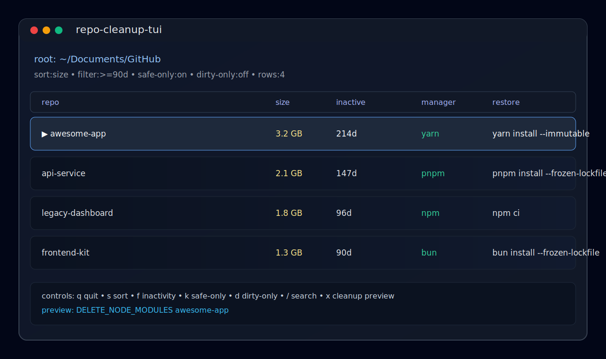

# repo-cleanup-tui



TUI scanner for reclaimable Node disk usage in repo folders.

## Goal

Find `node_modules` in git repos, sort by reclaimable size, filter by inactivity, and only suggest cleanup that package managers can safely restore.

## Run

```bash
yarn install
yarn start -- /Users/edahl/Documents/GitHub
```

If no path passed, tool scans current working directory.

## CLI install

Use as local package binary:

```bash
yarn link
repo-cleanup-tui /Users/edahl/Documents/GitHub
```

## Commands

```bash
repo-cleanup-tui                  # launch TUI
repo-cleanup-tui init             # create/update ~/.config/repo-cleanup-tui/config.json
repo-cleanup-tui scan --json PATH # machine-readable scan output
repo-cleanup-tui tui PATH         # explicit TUI mode
```

## Controls

- `q` / `esc`: quit
- `s`: toggle sort (`size` / `inactive`)
- `f`: inactivity filter (`all` -> `>=30d` -> `>=90d` -> `>=180d`)
- `k`: safe-only toggle (lockfile required)
- `d`: dirty-only toggle (git status)
- `j` or down arrow: next row
- `u` or up arrow: previous row
- `[` / `]`: page jump
- `r`: force full rescan (bypass cache)
- `/`: search repo path/branch
- `c`: clear search
- `w`: switch workspace root path
- `g`: toggle git context columns
- `x`: open cleanup preview for selected row

In cleanup preview:

- `p`: run dry-run cleanup audit event
- `y`: continue to confirm
- `n`: cancel preview

In confirm mode:

- type exact token `DELETE_NODE_MODULES <repo-folder-name>`, then `enter`

## Safety behavior

- Scans only repos that contain `.git`, `package.json`, and `node_modules`.
- Detects package manager via lockfile.
- Shows restore command (`yarn install --immutable`, `pnpm install --frozen-lockfile`, `npm ci`, `bun install --frozen-lockfile`).
- Cleanup is gated behind `x` -> preview -> typed confirmation token.
- Preview mode supports explicit dry-run before deletion.
- Guard checks block deletion unless lockfile exists and target is exact `repo/node_modules`.
- Manager-aware risk checks block unsafe cleanup by default (unknown manager, Yarn zero-install cache, missing lockfile).
- Audit log prints each dry-run/delete/block event with restore command.

## Trust posture

- local-first and no telemetry
- explicit user-triggered actions only
- safety gates before deletion
- full scan + cache controls (`r` for bypass)
