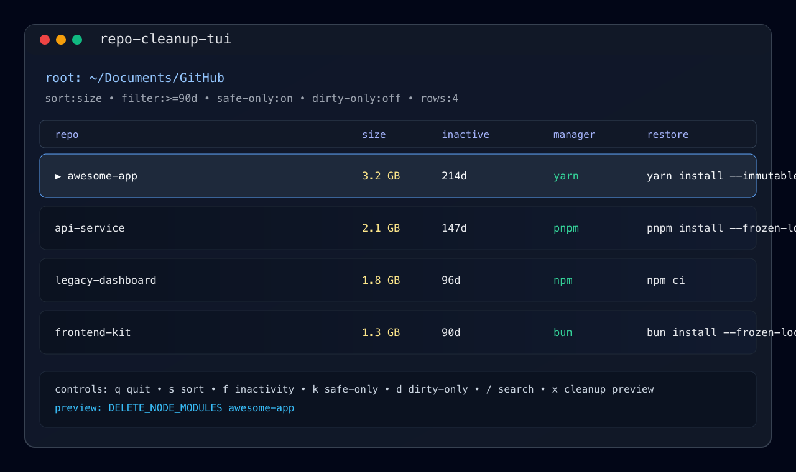

# repo-cleanup-tui



TUI for finding reclaimable `node_modules` folders under a workspace, sorting by size, and cleaning up only when package managers can restore dependencies.

## Goal

Scan git repos with `package.json` + `node_modules`, show reclaimable disk, filter by inactivity and safety, and delete `node_modules` behind preview + confirmation — never the repo itself.

## Install

### Homebrew

```bash
brew install ericdahl-dev/tap/repo-cleanup-tui
```

Formula updates on each `v*` tag via GoReleaser ([homebrew-tap](https://github.com/ericdahl-dev/homebrew-tap)).

### Go

Requires [Go 1.24+](https://go.dev/dl/). If your installed `go` is older, the toolchain may auto-download a newer one (that message is normal).

```bash
go install github.com/ericdahl-dev/repo-cleanup-tui@latest
```

Ensure `$(go env GOPATH)/bin` is on your `PATH` (e.g. `~/go/bin`).

Prefer `@latest` or `v0.1.2+`. Do not use `v0.1.0` for `go install` — that tag was published while the repo was private and remains broken in the public Go module proxy.

### From source

```bash
git clone https://github.com/ericdahl-dev/repo-cleanup-tui.git
cd repo-cleanup-tui
go build -o repo-cleanup-tui .
```

## Run

```bash
repo-cleanup-tui                  # TUI for cwd or configured workspace
repo-cleanup-tui /path/to/repos   # TUI for a specific root (e.g. ~/Documents/GitHub)
repo-cleanup-tui init             # write ~/.config/repo-cleanup-tui/config.toml
repo-cleanup-tui scan --json .    # machine-readable scan
```

On cold start the TUI loads a local scan cache (`.repo-cleanup-tui-scan-cache.json`, 10 minute TTL) when signatures still match. Press `r` for a full rescan.

## Commands

| Command | Description |
|---------|-------------|
| `repo-cleanup-tui [path]` | Start TUI (default workspace: cwd or config) |
| `repo-cleanup-tui tui [path]` | Start TUI explicitly |
| `repo-cleanup-tui init` | Interactive config wizard |
| `repo-cleanup-tui init --force` | Overwrite existing config |
| `repo-cleanup-tui scan [--json] [path]` | Scan workspace; `--json` prints candidates |

## Controls (browse)

| Key | Action |
|-----|--------|
| `j` / `↓`, `u` / `↑` | Next / previous row |
| `[` / `]` | Page up / down (20 rows) |
| `?` | Toggle help overlay |
| `s` | Toggle sort (`size` / `inactive`) |
| `f` | Inactivity filter (`all` → `≥30d` → `≥90d` → `≥180d`) |
| `k` | Safe-only (lockfile required) |
| `d` | Dirty-only |
| `g` | Git columns (branch, dirty) |
| `r` | Full rescan (bypasses cache) |
| `/` | Search path or branch; `c` clear |
| `w` | Switch workspace (saved to config, rescan) |
| `x` | Cleanup preview → `p` dry-run, `y` confirm, type token + Enter |
| `q` / `esc` | Quit or back from sub-modes |

## Development

```bash
go test -race ./...
go build -o repo-cleanup-tui .
golangci-lint run   # same as CI
```

## Release

Tag a version to build cross-platform archives, checksums, GitHub release assets, and update the Homebrew formula:

```bash
git tag v0.1.3
git push origin v0.1.3
```

The [release workflow](.github/workflows/release.yml) runs GoReleaser. Set repository secret `HOMEBREW_TAP_GITHUB_TOKEN` (PAT with push access to `ericdahl-dev/homebrew-tap`) so the tap formula updates automatically.

## Safety

- Scans only repos with `.git`, `package.json`, and `node_modules`.
- Detects package manager via lockfile; shows restore command per manager.
- Cleanup: `x` → preview → typed confirmation token; deletes `node_modules` only.
- Guards: lockfile required, exact `node_modules` path, manager-aware risk checks.
- Audit log on stderr for dry-run, delete, and block events.

## Trust

- Local-first, no telemetry
- Explicit user actions only
- Safety gates before deletion
